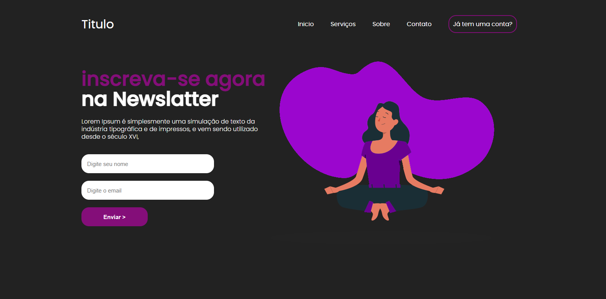

# Portifolio

Olá visistantes, esse é o meu portifolio e a minha evolução no front end: 

Hoje tenho maior altonomia em aplicar o CSS um exmeplo é a minha pagina pessoal:

Mas meu primeiro projeto publicado no github: UNES (Dado pelo curso: UDEMY Domine a Web 20 cursos): 

E tenho participado de alguns desafios como o DevChallenge ou Algum projeto por video:

